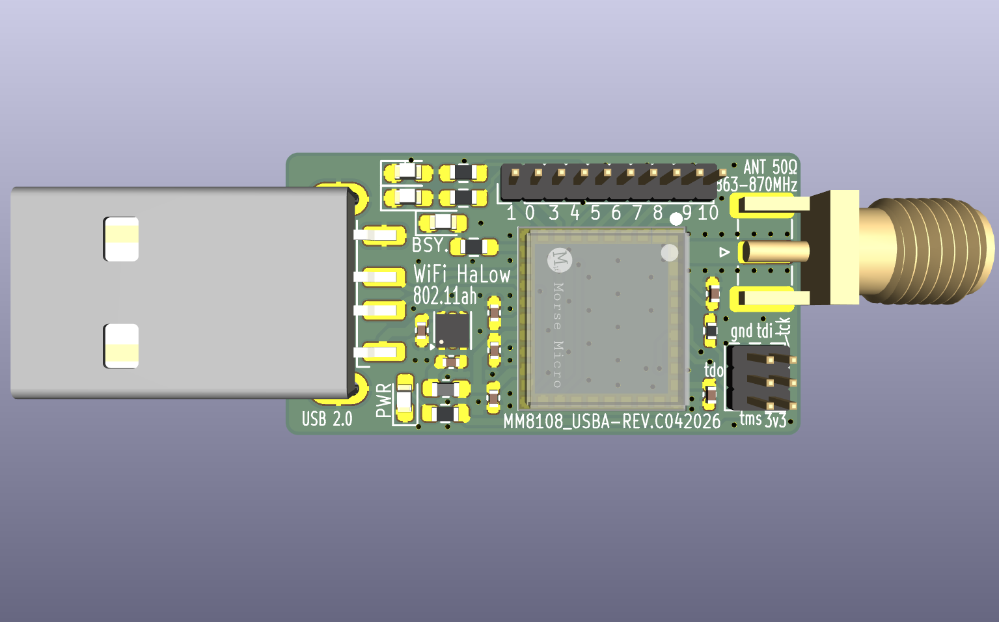
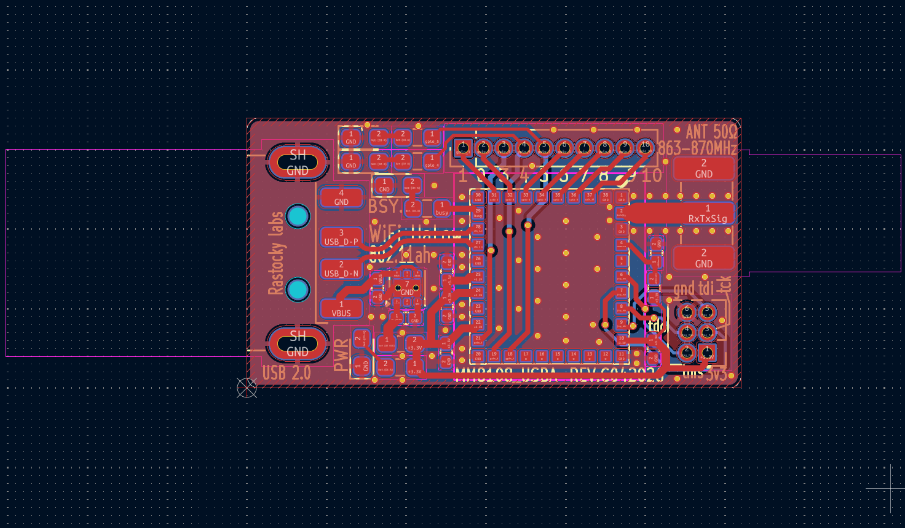

# MM8108 Carrier Platform (Wi-Fi HaLow)

Low-cost experimental hardware platform for Morse Micro MM8108 Wi-Fi HaLow (802.11ah) modules.  
USB-A carrier board is the current reference design, with additional form factors planned (M.2, USB-C/PCIe, HAT-style).

Focus: cost reduction vs official evaluation hardware, wireless networking experimentation, Reticulum mesh comms, IoT/embedded.

---

## Objectives

- Reduce cost vs official MM8108 dev kits / dongles
- Optimize for low-cost PCB fabrication (JLCPCB / PCBWay class vendors)
- 2-layer 1.6mm FR4 standard stackup
- Relaxed DFM (large vias, conservative routing constraints)
- Use widely available low-cost but robust components
- Maintain compact footprint (depending on form factor USB-A dongle, mini pcie/m.2, RPi hat)
- Provide expansion access for GPIO and debug experimentation

---

## Current Hardware: USB-A Carrier (usbaCarrierMM8108)

USB-A form-factor carrier board for MM8108 module.

## USB-A Carrier (revC)

| 3D View | Layout |
|--------|--------|
|  |  |

### Features
- USB-A plug carrier interface
- On-board power regulation (derated LDO design)
- Status LEDs mapped to GPIO
- GPIO breakout for future firmware revisions 
- Optional debug-oriented signal breakout (experimental)

### Notes (GPIO / Debug / JTAG)
- Some pins exposed for GPIO and firmware experimentation
- JTAG functionality is **not guaranteed and not officially supported** by vendor
- Routing included for flexibility, reverse engineering, and bring-up scenarios
- Intended for experimental firmware and hardware exploration use only

---

## Revision History (USB-A Carrier)

- **revA**: initial baseline MM8108 carrier design  
- **revB**: LED GPIO reassignment (GPIO0/1 → GPIO4/5)  
- **revC**: component sizing increased (0201 → 0402, 0402 → 0603) for assembly robustness and sourcing flexibility  

---

## Future Work

Planned additional carrier variants:

- USB-C / USB-to-PCIe Mini form factor
- M.2 (Key E / Key B) carrier board
- Raspberry Pi HAT-style integration
- Embedded IoT node variants

---

## Repository Structure

- `usbaCarrierMM8108/` – USB-A carrier PCB (active design)
- `libParts/` – shared KiCad libraries
- `manuf/` – fabrication outputs per revision (GERBER, BOM, PnP)
- future form factors added as separate KiCad projects

---

## Manufacturing Targets

- 2-layer FR4, 1.6mm
- low-cost PCB fabs (global vendors)
- relaxed DFM constraints
- assembly-friendly but compact component selection (0402 / 0603 preferred)
- no high-density / advanced process requirements

---

## Application Space

- Wi-Fi HaLow (802.11ah) experimentation
- long-range IoT links
- mesh / decentralized networking (e.g. Reticulum-class systems)
- embedded wireless prototyping

---

## Status

Active hardware development. USB-A carrier is the current reference implementation.

---

## License

This project is released under the MIT License.

Hardware designs may be used, modified, and manufactured for personal, educational, and commercial purposes.

No warranty is provided.

---

## Disclaimer

This project is an independent hardware design and is not affiliated with Morse Micro.

- Debug, GPIO, and JTAG-related routing is experimental
- JTAG functionality is not guaranteed and not officially supported
- Some signals are exposed for firmware experimentation and hardware bring-up
- Use at your own risk

---

## Hardware Intent Summary

Low-cost experimental Wi-Fi HaLow (802.11ah) hardware platform for embedded IoT and decentralized networking research.
